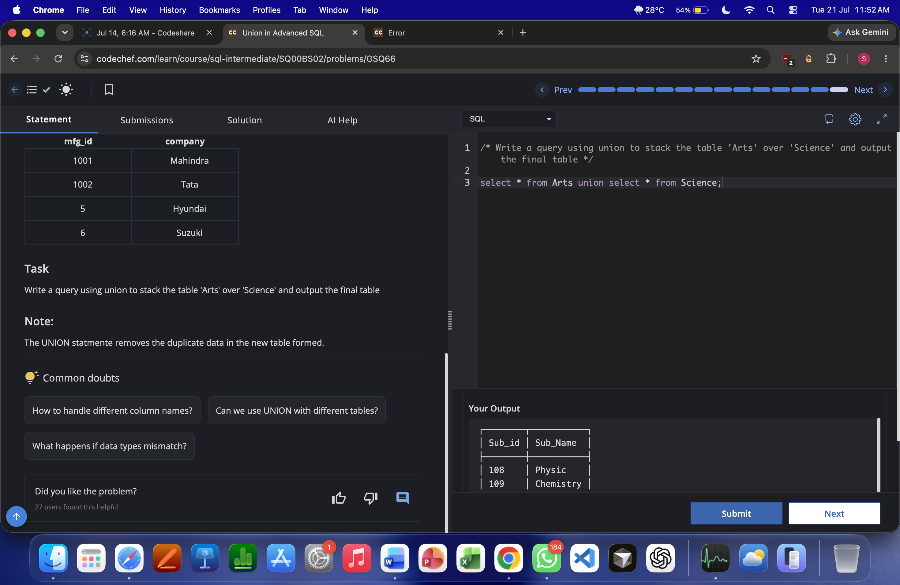
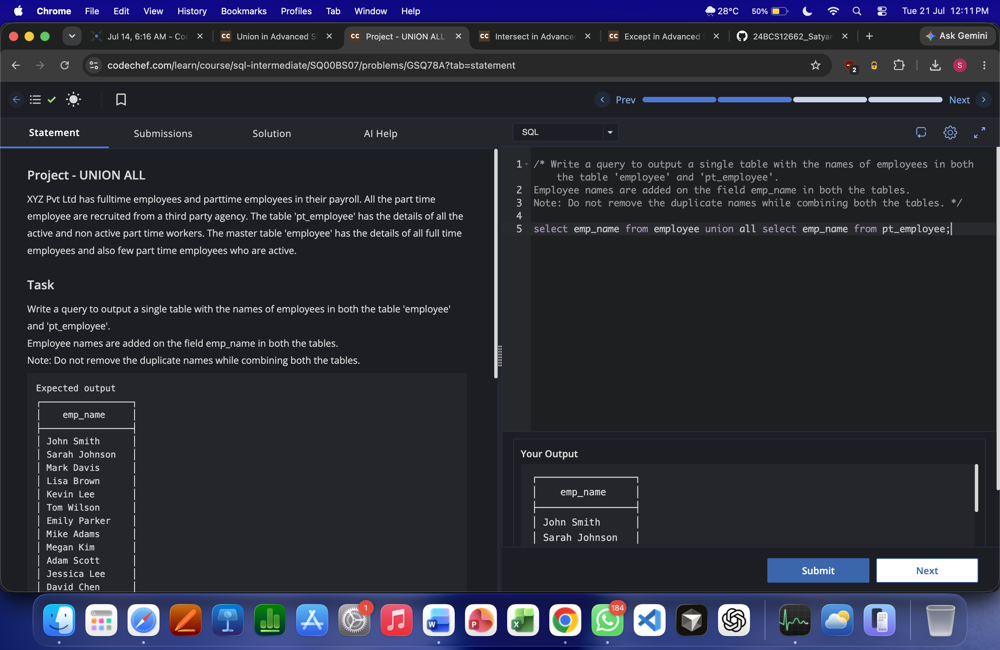
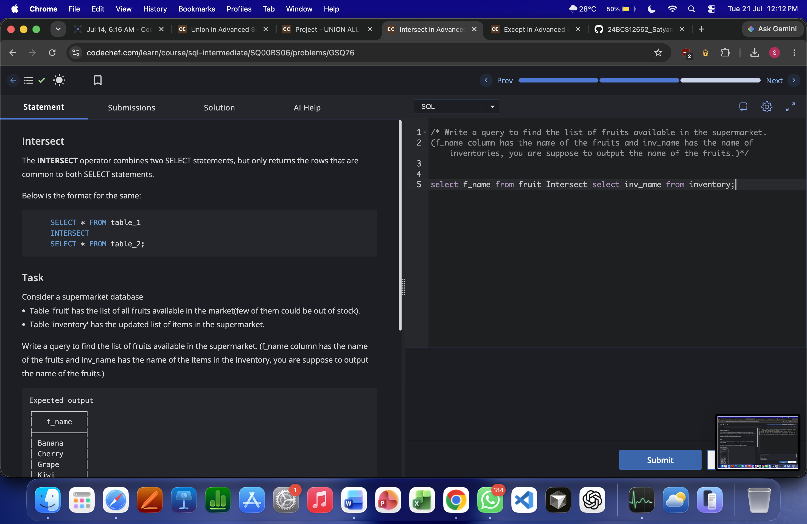
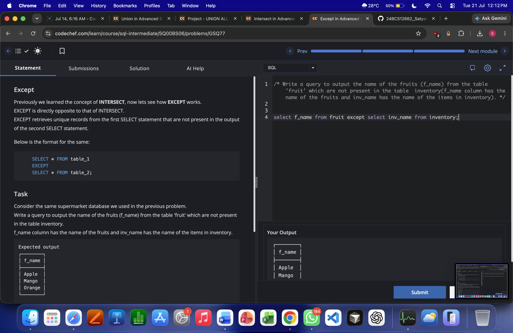

# Experiment 2

**Name:** Vansh 
**UID:** 25BCS80031

---

# Aim

To perform SQL set operations (**UNION**, **UNION ALL**, **INTERSECT**, and **EXCEPT**) on given tables and observe the output.

---

# Problem Statements

1. Use **UNION** to stack table `Arts` over `Science`.
2. Use **UNION ALL** to combine employee names from `employee` and `pt_employee` without removing duplicates.
3. Use **INTERSECT** to find fruits available in both `fruit` and `inventory`.
4. Use **EXCEPT** to find fruits from `fruit` that are not present in `inventory`.

---

# SQL Queries Used

## 1) UNION

```sql
select * from Arts union select * from Science;
```

## 2) UNION ALL

```sql
select emp_name from employee union all select emp_name from pt_employee;
```

## 3) INTERSECT

```sql
select f_name from fruit Intersect select inv_name from inventory;
```

## 4) EXCEPT

```sql
select f_name from fruit except select inv_name from inventory;
```

---

# Output Screenshots

## UNION


## UNION ALL


## INTERSECT


## EXCEPT


---

# Result

The set operation queries were executed successfully.  
`UNION`, `UNION ALL`, `INTERSECT`, and `EXCEPT` were applied correctly, and the outputs matched the expected results.
