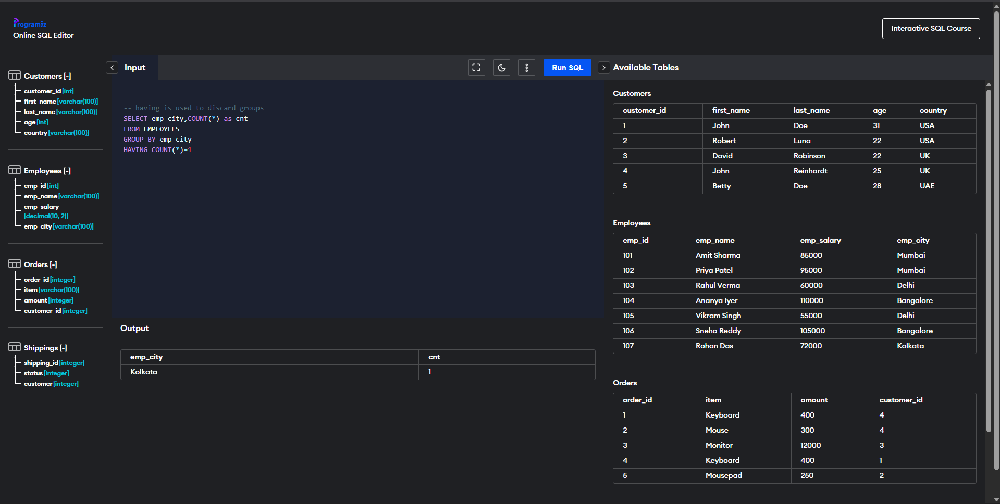

# Experiment 3

**Name:** Vansh  
**UID:** 25BCS80031

---

## Experiment 3.1 — Count using CASE

### Aim

To use **COUNT** with a **CASE** expression and **GROUP BY** to conditionally count records in each group.

### Problem Statement

Count the number of students with marks greater than 80 in each department using a `CASE` expression inside the `COUNT` aggregate function.

### SQL Query

```sql
select department,
count(case when marks>80 then 1 else null end)
as Dept_HighScore_Count
from student
group by department;
```

### Output


### Result

The query was executed successfully.  
The `COUNT` function with a `CASE` expression was used to conditionally count students scoring above 80 in each department, and the `GROUP BY` clause grouped the results by department. The output matched the expected result.

---

## Experiment 3.2 — HAVING Clause

### Aim

To use the **HAVING** clause with **GROUP BY** and **COUNT** to filter grouped results based on aggregate conditions.

### Problem Statement

Find the cities where exactly one employee exists by grouping employees by city and using `HAVING` to filter groups with a count of 1.

### SQL Query

```sql
-- having is used to discard groups
SELECT emp_city, COUNT(*) as cnt
FROM EMPLOYEES
GROUP BY emp_city
HAVING COUNT(*) = 1;
```

### Output



### Result

The query was executed successfully.  
The `HAVING` clause was used to filter grouped results after aggregation, retaining only those cities where exactly one employee exists. The output matched the expected result.
