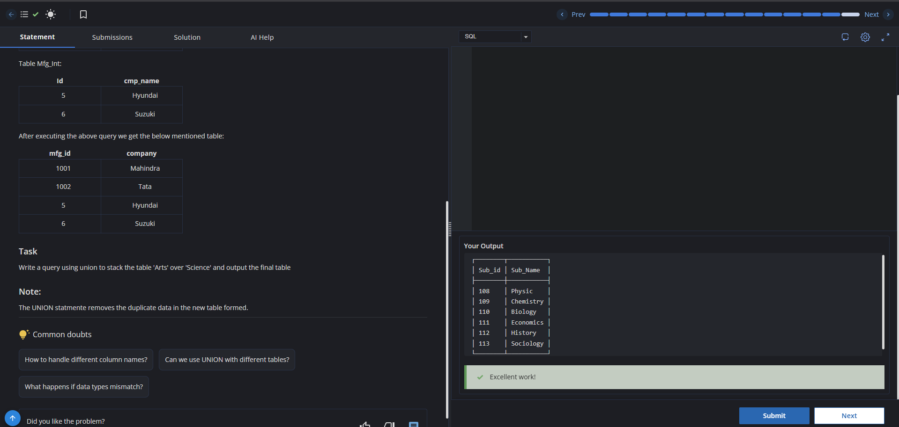
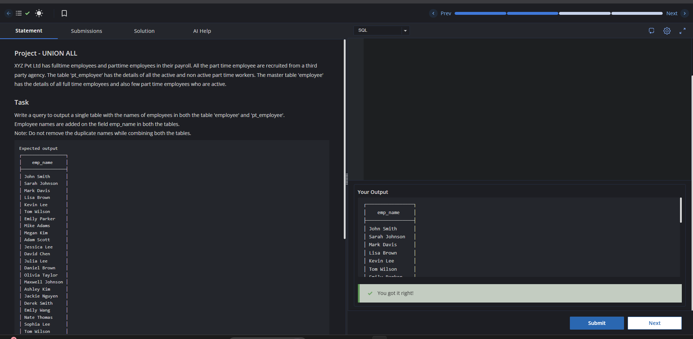

# Experiment 4

**Name:** Vansh
**UID:** 25BCS80031

---

# Aim

To practice SQL JOIN operations using given tables and display the required combined results.

---

# Problem Statements

1. List `customer_name` and `order_date` for all customers who have placed orders.
2. List all customer names and their corresponding `product_name`, including customers who have not placed any orders.
3. Display `product_name` and `order_date` for all products that are ordered.
4. Perform a `FULL OUTER JOIN` on `student` and `course` tables using `Course_id`.

---

# SQL Queries Used

## 1) Customers and Order Dates

```sql
select cust.customer_name, od.order_date
from customers as cust
inner join orders as od
on cust.customer_id=od.customer_id;
```

## 2) All Customers with Products (Including Customers with No Orders)

```sql
select cust.customer_name, p.product_name
from customers as cust
left join orders as od
on cust.customer_id=od.customer_id
left join products p
on od.product_name=p.product_name;
```

## 3) Products and Their Order Dates

```sql
select p.product_name,od.order_date
from products as p
inner join orders as od
on p.product_name=od.product_name;
```

## 4) FULL OUTER JOIN on Student and Course

```sql
select * from student
full outer join course
on student.Course_id=course.Course_id;
```

---

# Output Screenshots

## Questions 1, 2, and 3


## Question 4


---

# Result

All required JOIN queries were executed successfully, and the outputs matched the expected results.
